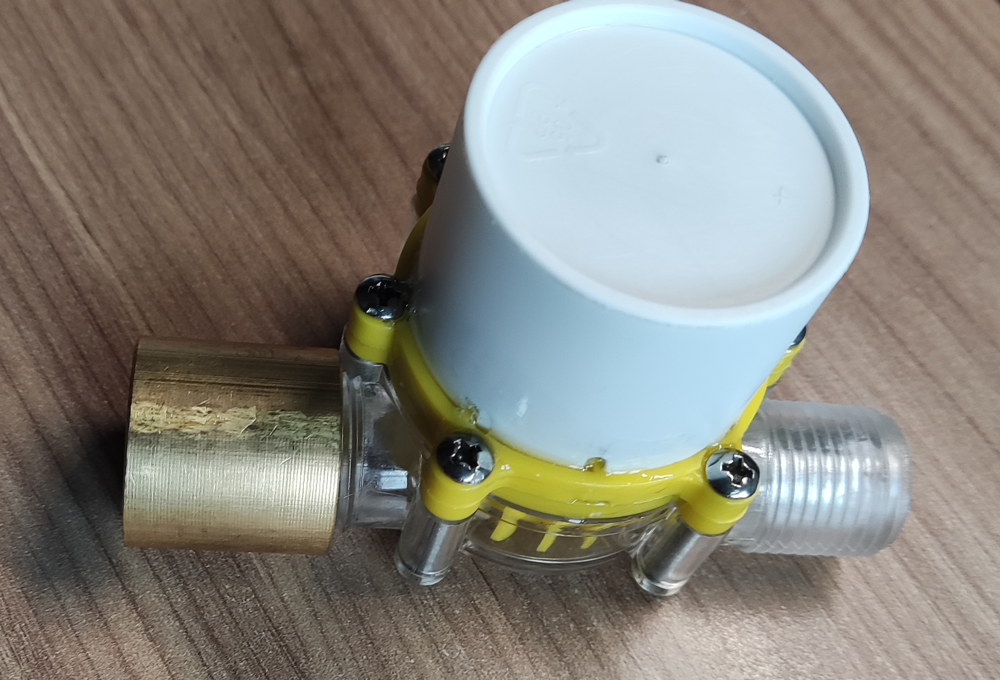
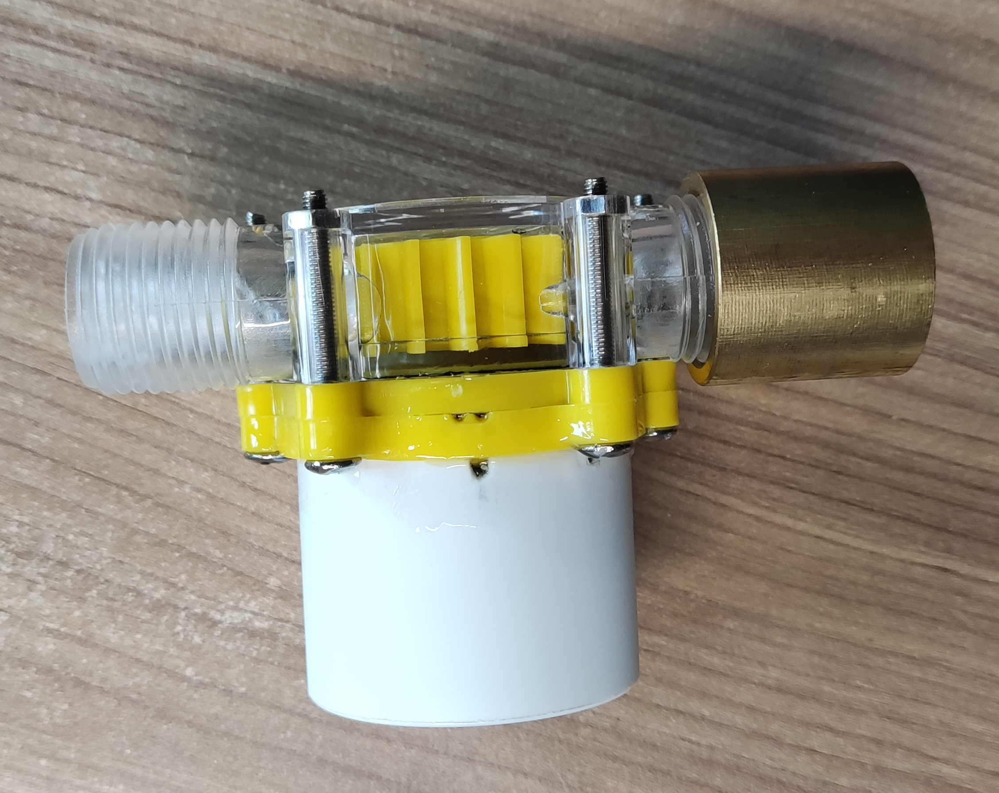
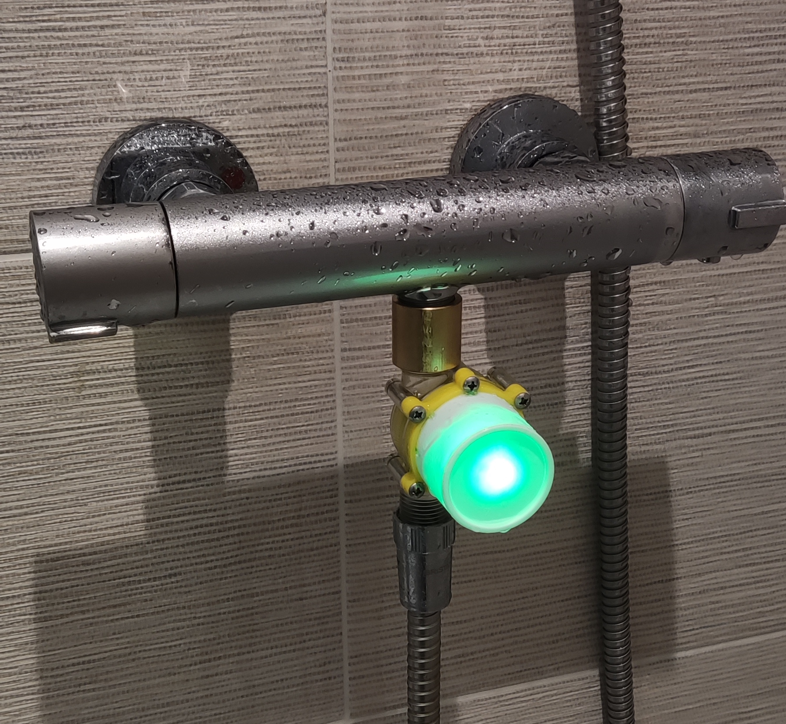
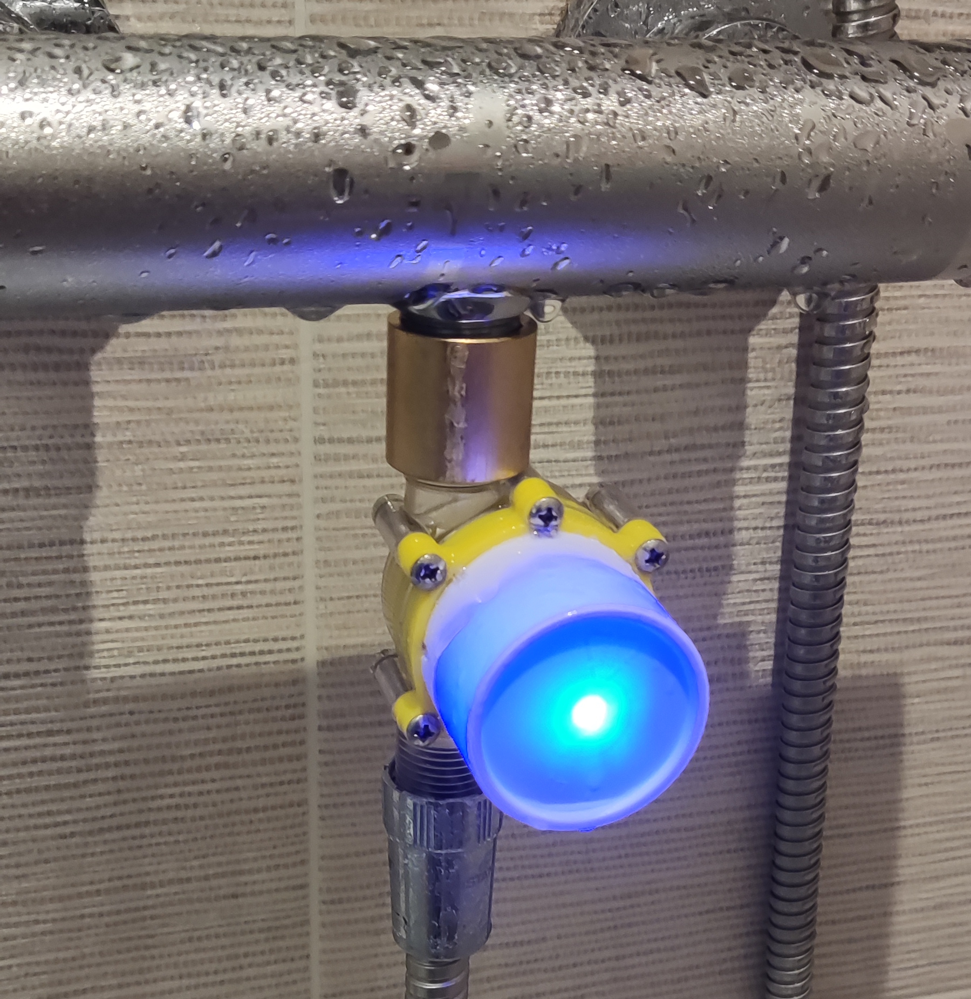

# Showeer Timer - aka Embedded RP2040 with Rust

Self-powered shower timer - inspired by teenagers spending ages in the shower; along with an excuse to build something. 

Saw something similar in a random catalog years ago.

Features:

- Uses water flow generator to create the power needed
- Compact-ish design to screw into the shower feed
- RP2040 as the micro-controller



## Generator

Search for Water Turbine, and lots of different things turn up on Amazon and eBay.

Decided to take a chance on [this one](https://www.amazon.co.uk/dp/B07WXK59MK?psc=1&ref=ppx_yo2ov_dt_b_product_details)

- Voltage was 12v - had no idea what type of current/voltages would actually come out. Knowing wthat something in 5-3.3v would be needed seemed that opting for 12v would give some room to drop this and get some current.
- The connectors were 1/2" threaded which is the UK standard for showers.

### Practical Experiments

On testing it seemed that with only a modest water flow it could get to 12v; taking it apart later determined that there was a regulator and capacitor inside that help to regulate the voltage.   Current to power a couple of LEds was quite sufficient.

This was witih a decent mains-level water pressure.


## Hardware

There's a 5mm tri=colour LED, driven with 3* 2n2222 transistors from the GPIO pins.

For power I had one these very small boards available [SparkFun BabyBuck Regulator Breakout - 5V](https://thepihut.com/products/sparkfun-babybuck-regulator-breakout-5v-ap63357?variant=42391014506691)

The controller I had available was a [Seed XIAO RP2040](https://thepihut.com/products/seeed-xiao-rp2040?variant=41181796335811)

To address the 'elephant-in-the-room' - a dual core processor is way too much; an embedded arduino, or a PIC controller would have been far better. Even smaller and even less power. 

But for 2 reasons; one the only controller that was small enough was the XIAO; plus after I'd managed to unsolder some of the pads previously it wasn't really up for anything needing SPI or I2C. 

Second reason is you can use Rust!

### Additional parts

Note that the brass converter which is internally threaded to 1/2".  so this was needed to connect to the shower outlet - with washer as well. 

The white outer casing a small plastic container from aquarium fish food; cleaned, label removed and cutdown. Glued with circuit inside. 



## Software

Contained in this repo based on this [tutorial](https://tutoduino.fr/en/tutorials/programing-in-rust-the-xiao-rp2040-board/)

When the power is connected; the software works through using 3 GPIO pins to control the LED. It'll move through Green-Blue-Red-Flashing Red. Moving ever 4 minutes, and ending on the flashing red.

To build the software please see the tutorial mentioned above, the two main commands I used where

```
cargo build --release
elf2uf2-rs target/thumbv6m-none-eabi/debug/xiao_rp2040_rs op2.uf2
```

Rather than `cargo run` which would to try and download the code to the XIAO, I was running this on WSL2 so the transfer was a manual step.

## Does it work?




Bascially Yes; does it reduce the shower time - well maybe it won't long term when the novelty wears off. 

The big issue is if you turn on the water slowly; the XIAO doesn't start properly. This will be connected to the power; and could be fixed by a hardware reset at some point. 

And really it would be so much better to use a different microprocessor (PIC probably) and also use a proper PCB. 

